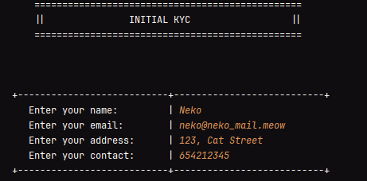
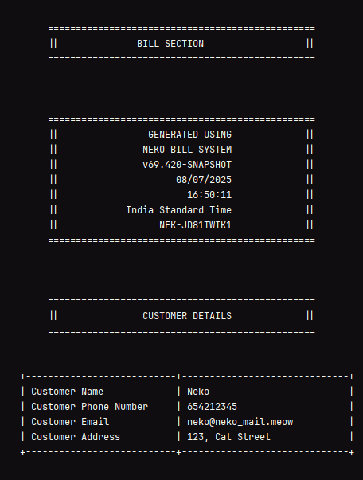
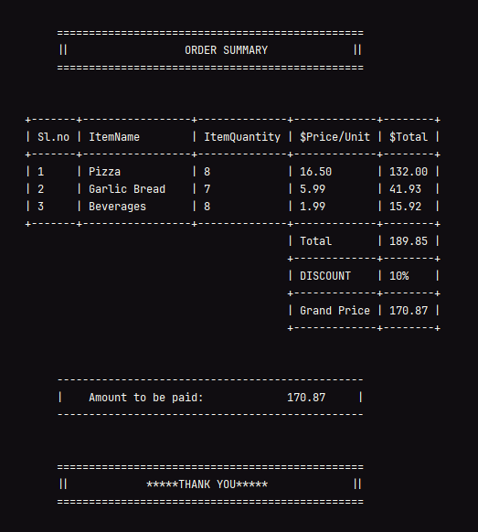

# 🍕 Neko Pizza Billing System

A handcrafted, terminal-based pizza ordering experience written in Java.  
Simulates a retro billing system with customer KYC, itemized billing, randomized order ID, and fully formatted ASCII interfaces.

Built with **Java** and an unhealthy obsession with `System.out.format()` alignment.

This is Module_1 Master Project Solution for my **University's** OOPs Course

---

## 🔧 Features

- 👤 Customer KYC section (name, email, phone, address)
- 📦 Commodity display with sizes & prices
- 🧾 Order input (pizza, garlic bread, beverages)
- 💵 Itemized billing with calculated totals and discounts
- 🆔 Fake order ID generation
- 🕒 Date, time, timezone stamping
- 🎨 Retro terminal UI with ASCII borders
- 💤 Randomized pause system to simulate "processing and printing"
- 😂 Easter eggs

---

## 📸 Sample Output

---

---

---

## ⚙️ Actions
This project comes with GitHub Actions instructions, hence feel free to download a release
from the [release page](https://github.com/ritesh-debnath-12/NekoBillSystem/releases/latest)

---

## 🤖 Building

- Clone this repository
- Run `src/PizzaOrder` or `src/PizzaOrder_Input` using IntelliJ
> But that's not building? oh, you want the hard way? sure...
- Generate class files using `javac src/PizzaOrder_Input`
- And then, run it using: `java -cp src PizzaOrder_Input`

---